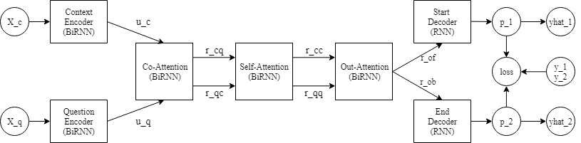
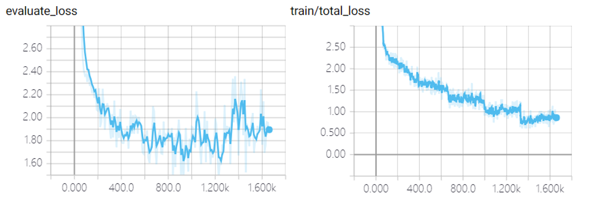

# QASystem

## Introduction
This is the repository for COMP90042 Question and Answering System Project.  

## Model

- Encode context and question with RNN
- Use attention find correlation
- Output the span of the answer

## Performance
### Metrics
| Model      | Train Loss @ Step | Dev Loss @ Step | Dev F1-score |
|------------|-------------------|-----------------|--------------|
| RNN        | 1.25 @ 1000       | 1.87 @ 1000     | 0.48         |
| CNN        | 1.21 @ 1000       | 1.78 @ 1000     | 0.41         |
| Rule Based | N/A               | N/A             | 0.18         |

### Loss

## Reference
[QANet: Combining Local Convolution with Global Self-Attention for Reading Comprehension[ICLR 2018]](https://arxiv.org/abs/1804.09541)  
  
[Zhouhan Lin et al. “A Structured Self-attentive Sentence Embedding”. In:CoRRabs/1703.03130 (2017).arXiv:1703.03130.](http://arxiv.org/abs/1703.03130.)  

[ Pranav Rajpurkar et al. “SQuAD: 100, 000+ Questions for Machine Comprehension of Text”. In:CoRRabs/1606.05250 (2016). arXiv:1606.05250.](http://arxiv.org/abs/1606.05250.)  

[Wenhui Wang et al. “Gated Self-Matching Networks for Reading Comprehension and Question Answering”](http://www.aclweb.org/anthology/P17-1018)  

